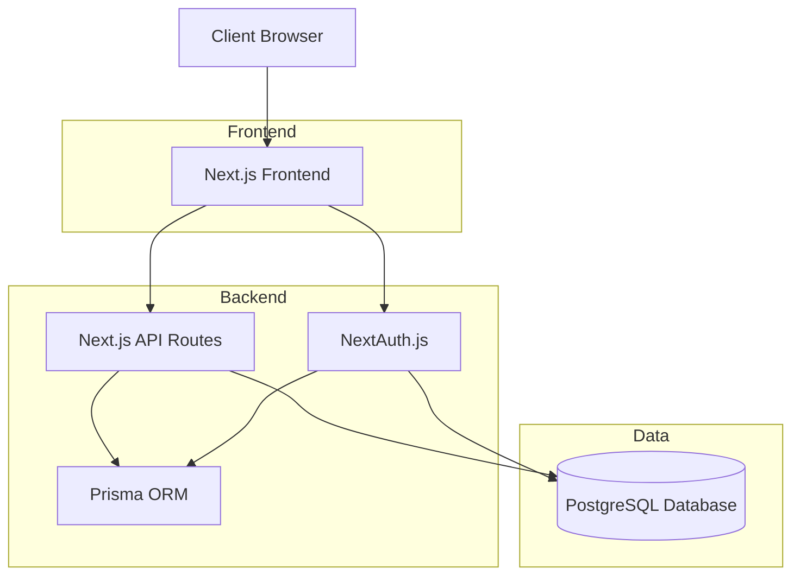
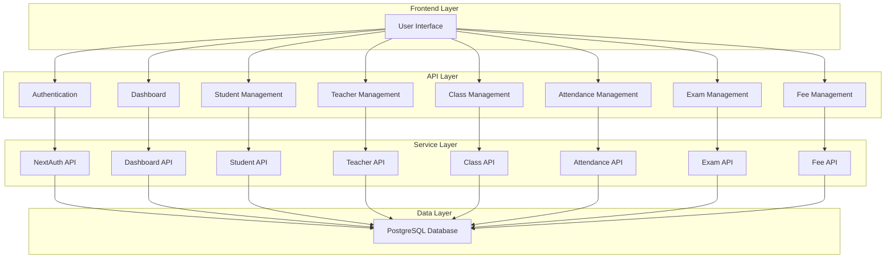
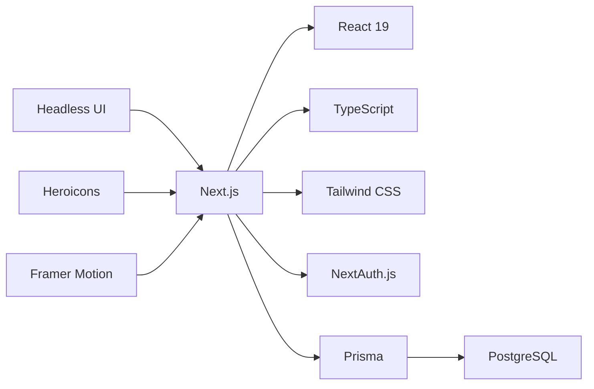
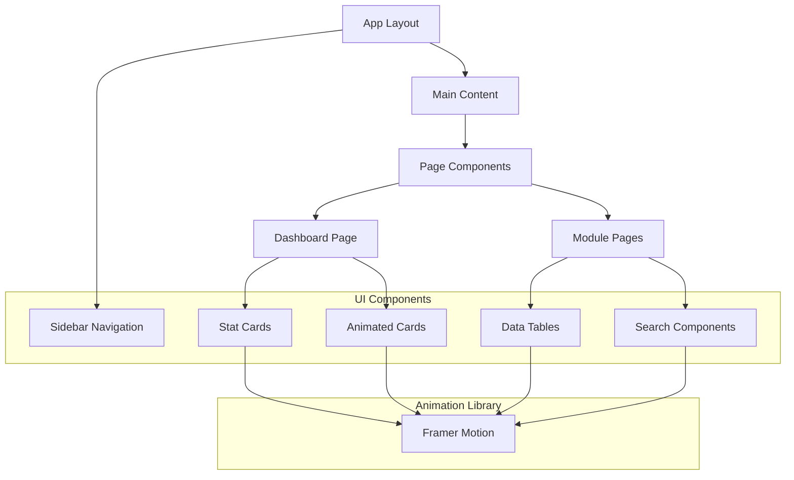

# System Architecture

## High-Level Architecture



## Module Architecture



## Database Schema Overview

```mermaid
erDiagram
    USER ||--o{ ADMIN : has
    USER ||--o{ TEACHER : has
    USER ||--o{ STUDENT : has
    USER ||--o{ PARENT : has
    USER ||--o{ NOTIFICATION : receives
    STUDENT ||--o{ ATTENDANCE : records
    STUDENT ||--o{ RESULT : achieves
    STUDENT ||--o{ FEE : pays
    STUDENT ||--o{ ENROLLMENT : enrolls
    TEACHER ||--o{ ATTENDANCE : takes
    CLASS ||--o{ STUDENT : contains
    CLASS ||--o{ SECTION : divided_into
    CLASS ||--o{ EXAM : schedules
    SUBJECT ||--o{ CLASS_SUBJECT : belongs_to
    CLASS ||--o{ CLASS_SUBJECT : has
    EXAM ||--o{ RESULT : generates
```

## Technology Stack



## Component Architecture


